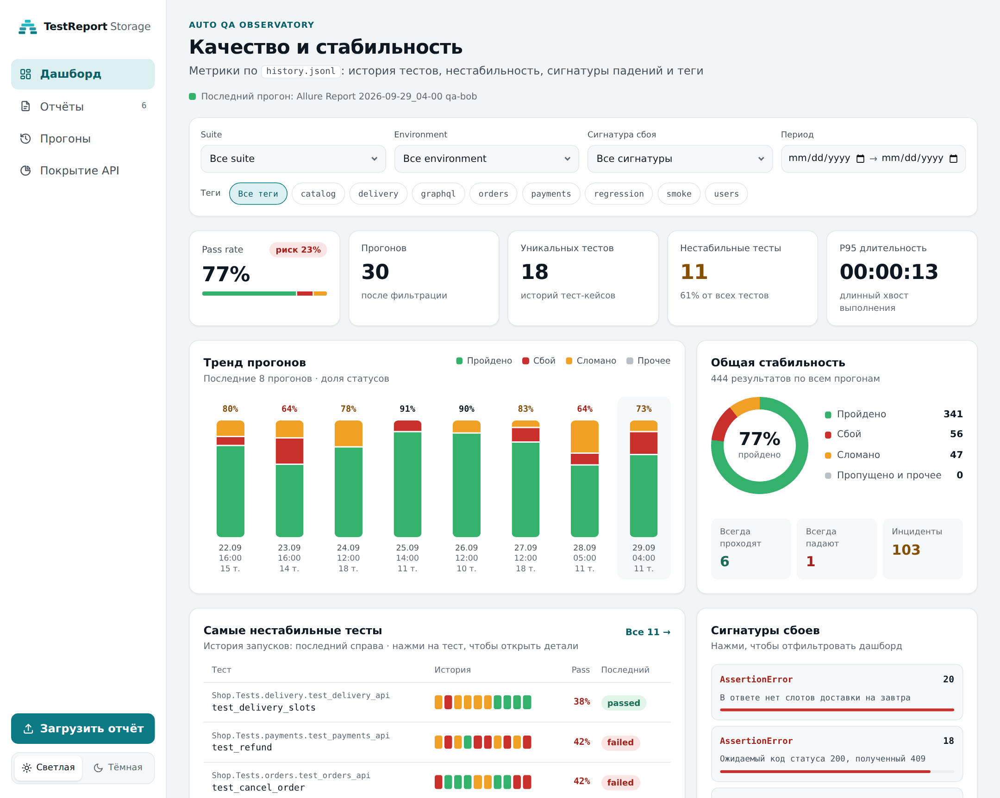
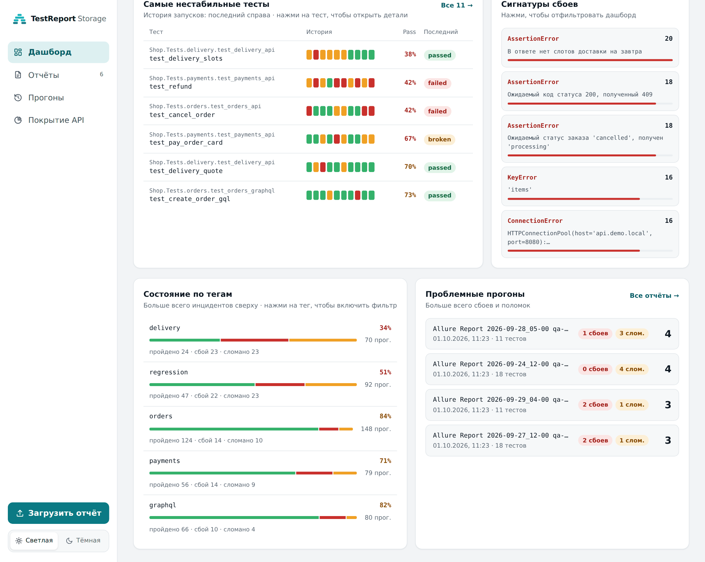
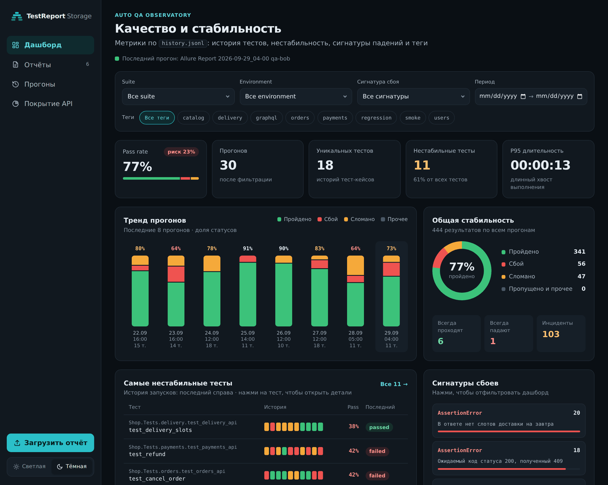
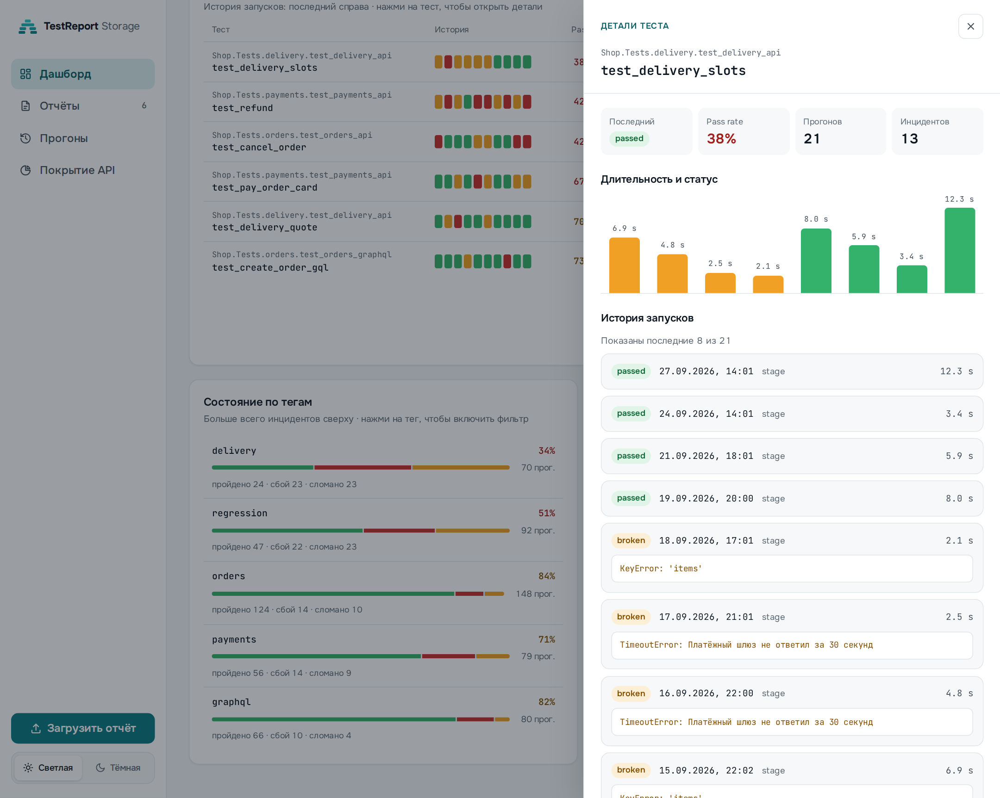
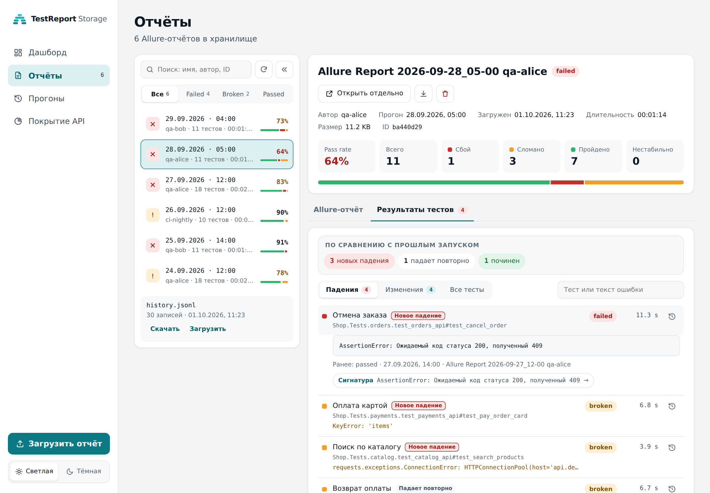
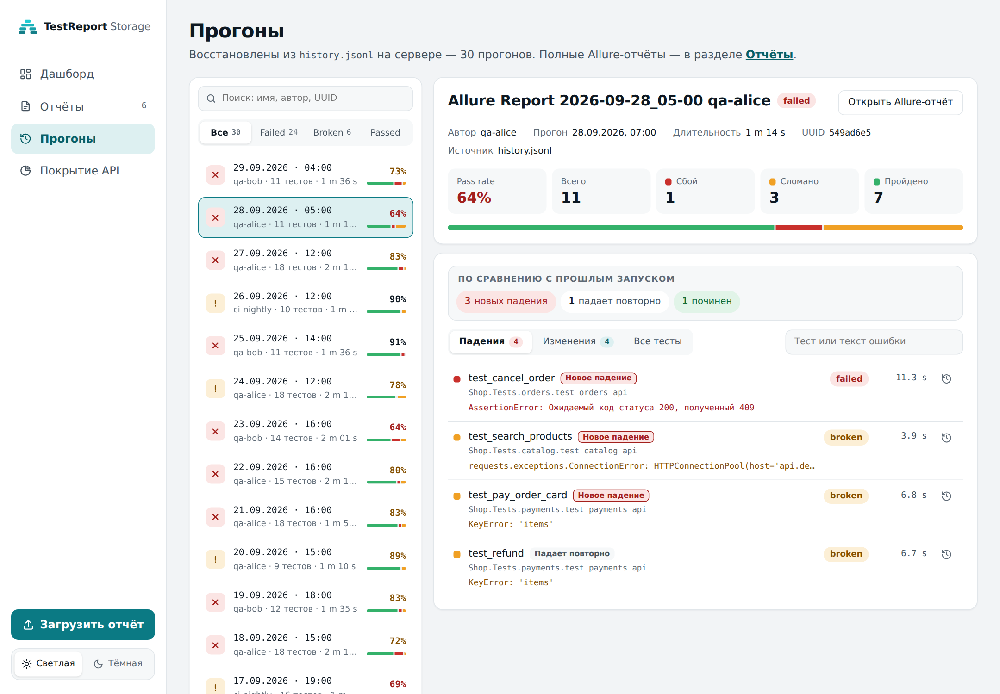
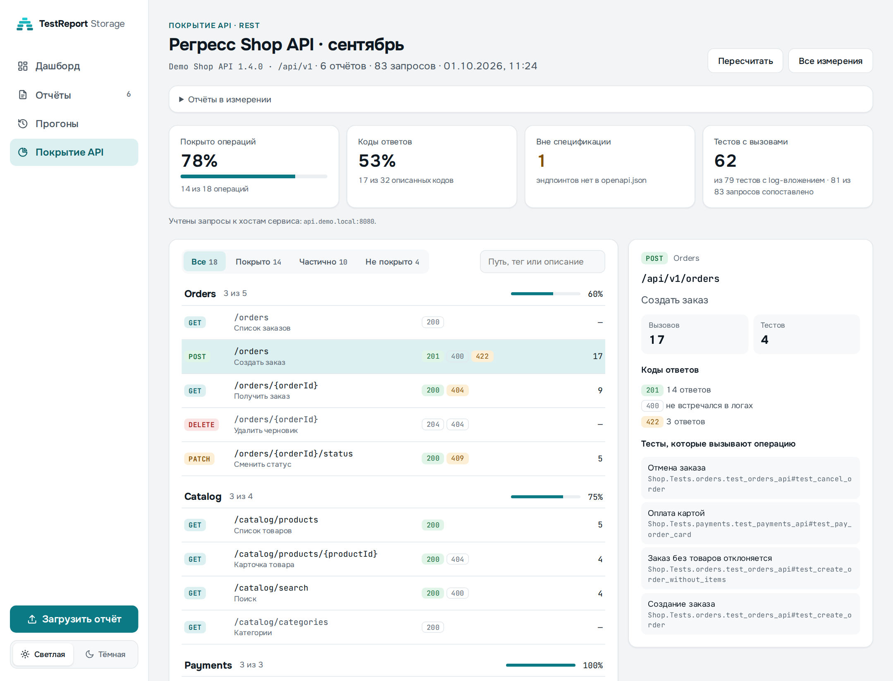
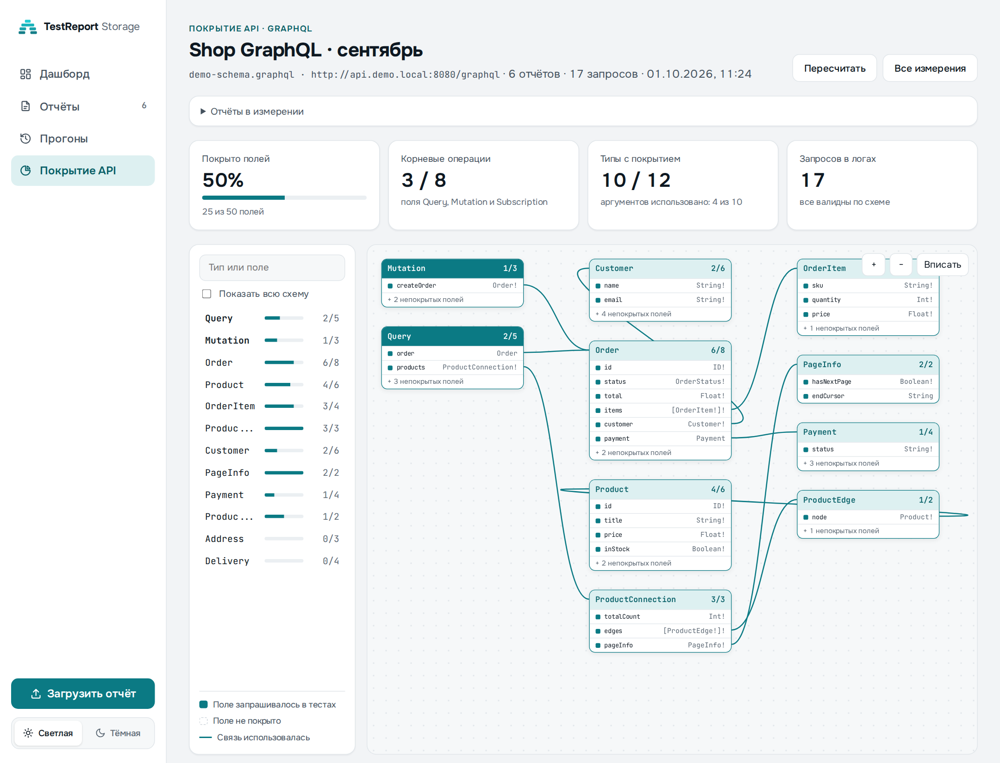
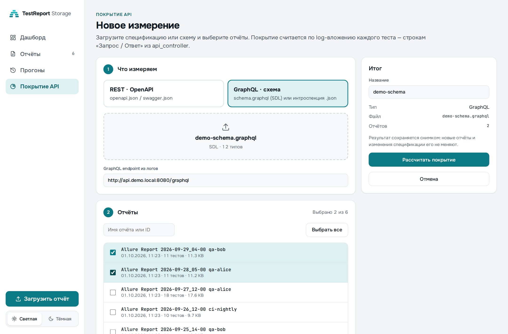

<div align="center">

# TestReport Storage

**Хранилище Allure-отчётов с аналитикой качества и измерением покрытия API**

Загружайте отчёты Allure, смотрите историю прогонов, находите нестабильные тесты
и проверяйте, какие эндпоинты REST и поля GraphQL на самом деле покрыты автотестами.

[English version](./README.en.md) · [Полная документация](./README.ru.md) · Vue 3 + FastAPI

</div>



## Зачем

Allure хорошо показывает один прогон, но плохо отвечает на вопросы команды:
стало ли лучше за неделю, какие тесты «мигают», какая ошибка ломает больше всего тестов
и что из API вообще не проверяется. TestReport Storage хранит отчёты в одном месте,
строит аналитику по `history.jsonl` и считает покрытие API прямо по логам тестов —
без изменений в самих тестах.

## Возможности

### Дашборд качества
Pass rate с риском, тренд последних прогонов по статусам, самые нестабильные тесты с полосой
последних запусков, топ сигнатур падений и состояние по тегам. Фильтры по suite, окружению,
сигнатуре, периоду и тегам применяются ко всему дашборду и сохраняются в URL — ссылкой
на отфильтрованный вид можно поделиться.

| Стабильность и сигнатуры | Тёмная тема |
|---|---|
|  |  |

### История конкретного теста
Клик по тесту открывает панель: последний статус, pass rate, длительность по прогонам
и история запусков с текстом ошибки.



### Отчёты Allure
Загрузка ZIP одной кнопкой, поиск и фильтр по статусу, встроенный просмотр Allure-отчёта,
скачивание и удаление. Вкладка «Результаты тестов» сразу показывает упавшие тесты
с ошибками — не нужно искать их внутри Allure. Каждый тест сравнивается с прошлым запуском:
видно, что упало впервые, что падает повторно и что починили. Из строки теста открывается
его история, а сигнатура ошибки ведёт на дашборд с фильтром по ней.



### Прогоны из истории
Все прогоны из `history.jsonl`, даже те, для которых ZIP-отчёт не загружали.
Данные берутся из серверного индекса постранично — тяжёлый `history.jsonl`
в браузер не скачивается.



### Покрытие API
Загрузите `openapi.json` или GraphQL-схему, выберите отчёты — сервис разберёт log-вложения
тестов и покажет, что покрыто. Результат сохраняется снимком, его можно пересчитать.

**REST** — покрытие операций и описанных кодов ответов, коды, которых нет в спецификации,
вызовы вне спецификации и тесты, вызывающие каждую операцию. Хосты сервиса определяются
по логам автоматически.



**GraphQL** — граф схемы в стиле [GraphQL Voyager](https://github.com/graphql-kit/graphql-voyager):
покрытые поля и связи подсвечены, видно, какие аргументы передавались и какие тесты
запрашивали поле. Запросы проверяются по схеме, фрагменты и union учитываются.



<details>
<summary>Создание измерения</summary>



</details>

### И ещё
- Светлая и тёмная темы, адаптивная вёрстка
- Ротация отчётов по лимиту (по умолчанию хранятся 10 последних)
- Инкрементальное обновление индекса истории при дозаписи `history.jsonl`
- REST API с документацией Swagger / ReDoc

## Как это работает

```
Allure ZIP ──► /api/reports/upload ──► storage/reports/<id>/   ──► просмотр, результаты тестов
history.jsonl ► /api/history ───────► storage/history_index.json ► дашборд, прогоны, детали тестов
openapi.json / schema.graphql + отчёты ──► разбор log-вложений ──► storage/coverage/<id>/
```

Для покрытия API тестовый фреймворк должен прикладывать к тесту текстовый лог с записями
о запросах. Сейчас поддерживается формат `api_controller`:

```
INFO my_log:api_controller.py:116 Запрос: POST http://host:8080/api/v1/orders
INFO my_log:api_controller.py:152 Статус код ответа: 201
INFO my_log:api_controller.py:72 Запрос: "http://host:8080/graphql" query { order(id: 1) { id status } } Переменные: None
```

## Быстрый старт

```bash
docker compose up --build
```

UI откроется на `http://localhost:8080`, Swagger — на `http://localhost:8080/docs`.

Локальная разработка:

```bash
# backend
cd backend && python3 -m venv .venv && source .venv/bin/activate
pip install -r requirements.txt
uvicorn app.main:app --reload --port 8000

# frontend (в другом терминале)
cd frontend && npm ci && npm run dev   # http://localhost:5173
```

Настройки окружения, описание API и устройство backend — в [полной документации](./README.ru.md).

## Стек

Vue 3 · TypeScript · Vite — FastAPI · Pydantic · graphql-core — хранение в файловой системе, без БД.

> Скриншоты сделаны на демо-данных вымышленного магазина.
